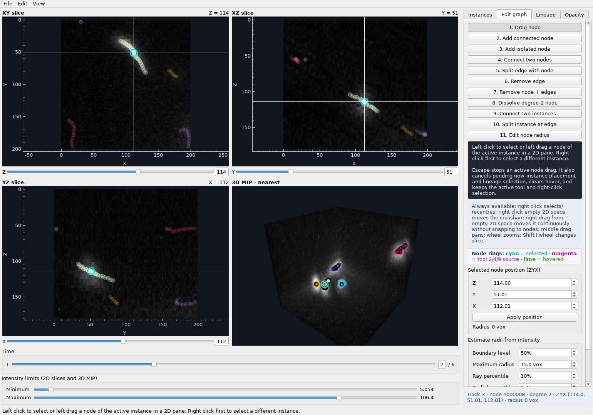
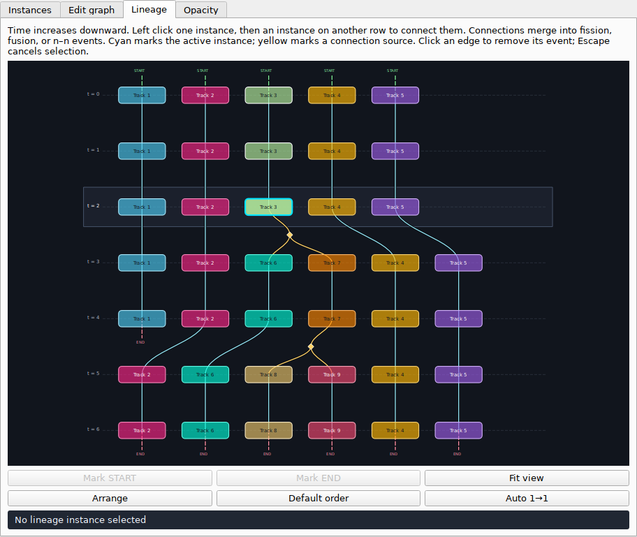

# CellAnnotator4D

Annotate 3D centreline graphs, adjust their thickness, and link instances across
TIFF time series to record continuity, fission, and fusion.

## Download

**[Download a desktop release →](https://github.com/CellSMB/CellAnnotator4D/releases)**
No Python or environment setup is needed.

Choose your installer under **Assets** (not the source-code archives):

| Computer | Download | Install |
| --- | --- | --- |
| Windows | `windows-x64-setup.exe` | Run the installer, then open CellAnnotator4D from Start. |
| Mac · Apple Silicon (M-series) | `macos-arm64.dmg` | Open the DMG and drag CellAnnotator4D into Applications. |
| Mac · Intel | `macos-x64.dmg` | Open the DMG and drag CellAnnotator4D into Applications. |

Releases are unsigned. If your computer blocks opening the app, follow the
[Windows and macOS installation help](packaging/INSTALL.md).

## Open and save

1. Open an image with **File → Open TIFF**, or resume with **Open project…**.
   You can also drop either file onto the window.
2. Use **T** to choose a frame and the **Z / Y / X** sliders to choose slices.
   Images should be `TZYX` time series or a single `ZYX` volume.
3. Save with **File → Save**. The first save creates a `.cpv.json` annotation
   project. Keep it with its TIFF: projects reference images rather than embed them.

## Explore the views

*The `crop1_fusion` demo from `../test_dataset`, with converted annotations.
Maximum intensity is set to 80% of the slider range. Demo data are not bundled
with the app.*

The three slices share a crosshair; the 3D pane shows a maximum-intensity
projection. **Minimum / Maximum** adjust contrast in all four views.

| Gesture | Action |
| --- | --- |
| Right click a node or edge · 2D or 3D | Select its instance and recenter the slices. |
| Right click empty space · 2D | Move the crosshair within that slice. |
| Right drag from empty space · 2D | Move the crosshair continuously, without snapping to graphs. |
| Middle drag | Pan the hovered view. |
| Mouse wheel | Zoom the hovered view. |
| Shift + wheel · 2D | Step through slices. |
| Left drag · 3D | Rotate the volume. |

## Annotate

In **Instances**, choose **Create new**, then click the first node in a 2D pane.
In **Edit graph**, continue clicking to trace connected nodes. New positions use
that pane's current slice for the hidden coordinate. Right click an existing
graph to make it active before editing it.

Tools act while **Edit graph** is open. Use the buttons or these hotkeys;
hover over a tool for detailed guidance.

| Key | Tool | Click / drag |
| --- | --- | --- |
| `1` | Drag node | Left drag an active-instance node in 2D. |
| `2` | Add connected node | Click a source node, then empty 2D space; keep clicking to extend. |
| `3` | Add isolated node | Click empty 2D space. |
| `4` | Connect two nodes | Click two nodes in the same instance. |
| `5` | Split edge with node | Click an edge. |
| `6` | Remove edge | Click an edge. |
| `7` | Remove node + edges | Click a node. |
| `8` | Dissolve degree-2 node | Click a node with two neighbours. |
| `9` | Connect two instances | Click a node in each; the first instance is retained. |
| `0` | Split instance at edge | Click a bridge edge that separates the graph into two components. |
| `R` | Edit node radius | Select a node, then Ctrl + left drag outward in 2D; release to apply. |

Stationary left clicks in 3D also perform node/edge edits; place and drag nodes
in 2D. For exact coordinates, use **Selected node position (ZYX) → Apply position**.
**Estimate radii from intensity** sets thickness for the active instance or
current frame. Radius values use voxel units.

Node rings show **cyan** selection, **magenta** connection source, and **lime**
hover. **Esc** cancels pending placement, drags, radius previews, or connection
sources while keeping the active tool and selection.

Use **Instances** to rename, delete, or copy a graph to the previous/next frame.
Copies preserve shape and radii; connect their lineage separately.

## Link instances through time

*The same demo in the Lineage view; the panel is expanded here for readability.*

Time runs downward. **Left click** an instance, then one on another time row to
connect them. Repeated connections form 1→1, fission (1→many), fusion (many→1),
or combined events automatically.

- **Right click an instance** to open its frame and select it.
- **Left click an edge** to remove its entire event; **Esc** cancels a pending connection.
- **Middle drag** to pan; **wheel** to zoom; **Fit view** to see all tracks.
- **Mark START / END** records a missing predecessor or successor.
- **Arrange** reduces crossings; **Default order** restores the original layout.
- **Auto 1→1** matches free endpoints in adjacent frames, preserving existing events.

Cyan marks the active instance; yellow marks a pending connection source.

## Adjust overlays

In **Opacity**, control masks, radius fills, and node circles independently.
**All / Selected / None** shows each radius layer for every instance, the active
instance, or neither. Enable **Adjust node opacity by slice distance** to fade
out-of-slice nodes using near/far distances and an opacity range.

Companion masks load automatically beside the TIFF when named, for example,
`sample_cp_masks.tif` (`_masks` and `_mask` also work). Masks and radius fills are
visual guides; click the graph to edit. Display settings do not change annotations.

## Keyboard reference

| Shortcut | Action |
| --- | --- |
| `Ctrl+O` | Open TIFF |
| `Ctrl+Shift+O` | Open project |
| `Ctrl+S` / `Ctrl+Shift+S` | Save / Save as |
| `Ctrl+Z` | Undo an annotation edit |
| `Ctrl+Y` / `Ctrl+Shift+Z` | Redo |
| `Ctrl+0` | Fit all 2D views |
| `Ctrl+R` | Reset the 3D camera |
| `1`–`9`, `0`, `R` | Choose an edit tool (table above) |
| `Esc` | Cancel the pending interaction |

Shortcuts above use Windows/Linux notation; the menus show macOS equivalents.
Undo covers annotation edits, including lineage and radii; navigation and display
adjustments stay outside the undo history.

---

[Source setup & conversion](docs/DEVELOPMENT.md) ·
[Desktop packaging](packaging/README.md) ·
[Report an issue](https://github.com/CellSMB/CellAnnotator4D/issues)
